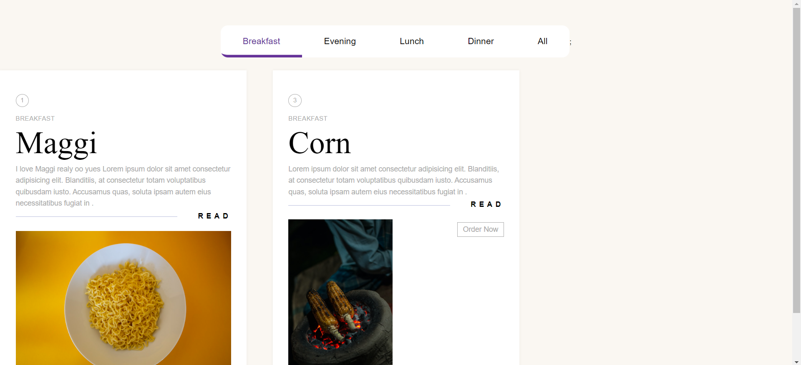
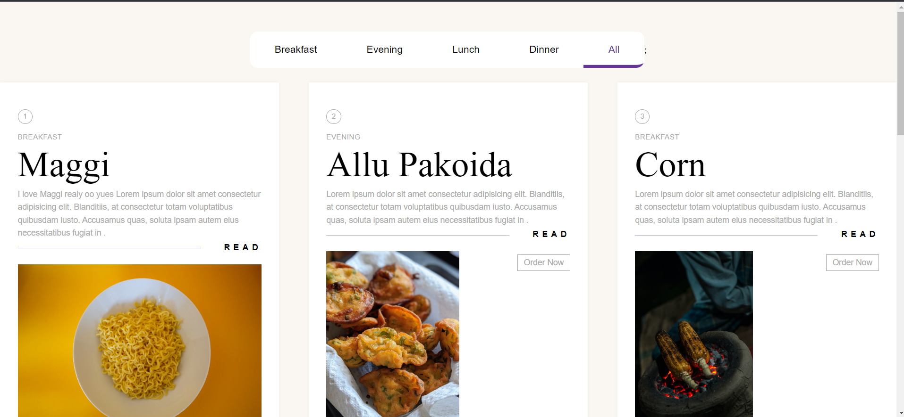

# Restaurant App

A React-based web application that serves as a restaurant menu, allowing users to explore various dishes categorized into breakfast, evening food, lunch, and dinner.

## Features

- **Responsive Design:** The app is built using React to provide a seamless and responsive user experience on various devices.
  
- **Categorized Menu Bar:** The navigation bar includes categories such as breakfast, evening food, lunch, dinner, and an option to view all dishes.

- **Diverse Dish Selection:** Users can explore a variety of dishes within each category, accompanied by detailed information.

  ## Screenshots

*Break Fast Food*

*All Food*
